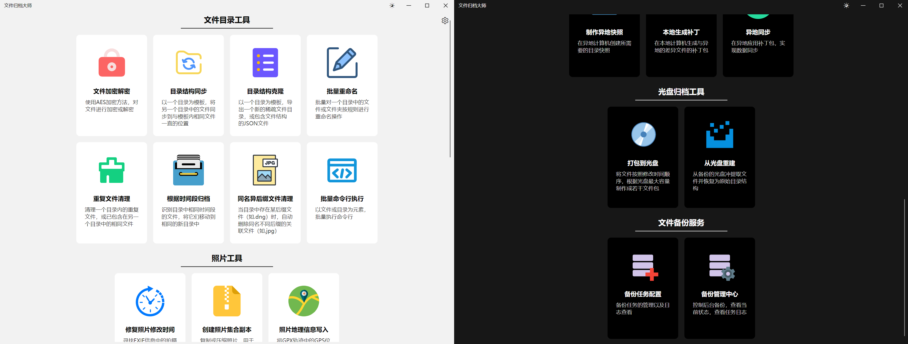

# 简介

这是一套协助用户对文件进行处理、管理、备份、同步的工具集。

在开始这个项目之前的许多年，我已经陆续写了很多的用于备份、同步、管理文件或照片的软件，包括：

- [文件自动备份系统](https://github.com/autodotua/FileBackuper_New)
- 文件批量操作
- [异地备份离线同步](https://github.com/autodotua/OffsiteBackupOfflineSync)
- [照片瘦身工具](https://github.com/autodotua/PhotoSlimming)
- [照片归档工具](https://github.com/autodotua/PhotoArchivingTools)
- [光盘归档工具](https://github.com/autodotua/DiscArchivingTool)
- 控制台小程序集
- 文件归位器
- 文件夹加密

这些工具功能各异，界面各不相同，技术水平差异很大，操作方式也不尽相同。因此，我希望通过本项目，把这些工具进行整合，使用跨平台的[Avalonia](https://github.com/AvaloniaUI/Avalonia)技术承载GUI。

# 截图

## 主界面

## 文件目录工具

## 照片工具

## 异地备份离线同步

## 光盘归档工具

## 文件备份服务

# 工具和帮助

[基本使用帮助](./helps/basic.md)

## 文件目录工具（`FileTools`）

一套用来解决文件、目录（特别是图像文件）在预处理、整理、存档、浏览等环节存在问题的自动化工具

[文件目录工具帮助](./helps/files.md)

| 工具名       | 用途                                                         | 期望解决的问题                                               | 类名前缀             | 原项目                                                       |
|-----------| ------------------------------------------------------------ | ------------------------------------------------------------ | -------------------- | ------------------------------------------------------------ |
| 根据时间段归档   | 识别目录中相同时间段的文件，将它们移动到相同的新目录中       | 例如对于航拍照片，多次起飞的照片和视频会混在一起。通过该工具，可以通过拍摄时间来自动将不同航次的照片和视频进行归类。 | `TimeClassify`       | [照片归档工具](https://github.com/autodotua/PhotoArchivingTools) |
| 附属文件清理 | 自动清理与主文件同名的关联文件。例如，当目录中存在.dng文件时，自动删除同名但不同后缀的.jpg等关联文件。 | 当拍摄了RAW+JPG格式的照片时，若决定处理RAW文件，那么JPG格式是多余的，需要删除。 | `TwinFileCleaner`  | [照片归档工具](https://github.com/autodotua/PhotoArchivingTools) |
| 文件加密解密 | 使用AES加密方法，对文件进行加密或解密 | 需要对一个文件夹内的文件和子文件进行加密，并需要保留目录结构，需要加密文件名、文件夹名或目录结构。 | `Encryptor` | [照片归档工具](https://github.com/autodotua/PhotoArchivingTools) 文件夹加密 |
| 目录结构同步 | 以一个目录为模板，将另一个目录中的文件同步到与模板内相同文件一直的位置 | 有两份初始状态一样的目录，其中一份中的某些文件进行了移动等操作，希望能够让另一份也同步应用更改，避免不必要的复制操作。 | `DirStructureSync` | [异地备份离线同步](https://github.com/autodotua/OffsiteBackupOfflineSync) 控制台小程序集 |
| 目录结构克隆 | 以一个目录为模板，生成一个新的目录，目录中文件与模板一致，但大小为0 | 需要保存一个目录的结构，但是不需要了解文件的内容，只是想用尽可能小的容量存储文件树状结构。 | `DirStructureClone` | [异地备份离线同步](https://github.com/autodotua/OffsiteBackupOfflineSync) 文件归位器 |
| 批量重命名 | 批量对一个目录中的文件或文件夹按规则进行重命名操作 | 需要对一个目录中的文件按一定规则进行重命名。 | `Rename` | 文件批量操作 |
| 重复文件清理 | 清理一个目录内的重复文件，或已包含在另一个目录中的相同文件 | 一些相同的文件散落在各个地方，为了节省空间，需要删除一部分 | `DuplicateFileCleanup` | 控制台小程序集 |
| 批量命令行执行 | 以文件或目录为元素，批量执行命令行 | 有一个能够传入参数的可执行文件，需要将某个目录下的所有子目录或文件作为参数，传入可执行文件并运行，每个子目录或文件作为参数运行一次。例如需要对指定目录下筛选后的文件分别压缩。 | `BatchCommandLine` |  |
| 硬链接去重 | 将一个目录中二进制相同的文件指向同一个硬盘物理地址，即硬链接，以减少磁盘占用 | 加入一个目录中有很多完全相同的文件，用这个工具可以大幅减少占用空间 | `LinkDeduplication` | |

## 照片工具（PhotoTools）

[照片工具帮助](./helps/photos.md)

| 工具名           | 用途                                                         | 期望解决的问题                                               | 类名前缀             | 原项目                                                       |
| ---------------- | ------------------------------------------------------------ | ------------------------------------------------------------ | -------------------- | ------------------------------------------------------------ |
| 修复照片修改时间 | 寻找EXIF信息中的拍摄时间与照片修改时间不同的文件，将修改时间更新闻EXIF时间 | 对照片进行处理后，文件修改时间会更新，不利于部分软件的照片排序，需要从EXIF中读取实际拍摄时间，对文件修改时间进行更新。 | `RepairModifiedTime` | [照片归档工具](https://github.com/autodotua/PhotoArchivingTools) 控制台小程序集 |
| 创建照片集合副本 | 复制或压缩照片，用于生成更小的照片集副本                     | 需要将硬盘中整理后的部分照片复制到手机中以便随时查看，但可能存在文件过大放不进手机、只需要部分目录中的文件、只需要部分类型文件等需求。 | `PhotoSlimming`      | [照片归档工具](https://github.com/autodotua/PhotoArchivingTools) [照片瘦身工具](https://github.com/autodotua/PhotoSlimming) |
| 照片地理信息写入 | 将GPX轨迹中的GPS位置信息，根据拍摄时间自动匹配并写入照片Exif | 相机拍摄的照片，不包含地理信息，无法根据位置查找照片。使用该工具，可以将拍摄时在相关工具记录的GPX轨迹中找到拍摄时间所在的位置，并写入照片元数据中。 | `PhotoGeoTagging`    |                                                              |
| 照片位置分类     | 根据照片EXIF信息中的地理位置，以及用于提供分类标准的矢量数据，将照片移动到不同的目录 | 有大量的照片，这些照片由手机或其他能够定位的设备拍摄，并写入了位置信息。希望将这些数据 | `PhotoGeoSorter`     |                                                              |

## 异地备份离线同步（`OfflineSync`）

在无法通过网络或实地全量同步的情况下，使用增量同步的方式，利用小容量设备完成异地和本地磁盘的数据同步

[异地备份工具帮助](./helps/offline.md)

| 工具名       | 用途                                     | 类名前缀 | 原项目                                                       |
| ------------ | ---------------------------------------- | -------- | ------------------------------------------------------------ |
| 制作异地快照 | 在异地计算机创建所需要的目录快照         | `Step1`  | [异地备份离线同步](https://github.com/autodotua/PhotoArchivingTools) |
| 本地生成补丁 | 在本地计算机生成与异地的差异文件的补丁包 | `Step2`  | [异地备份离线同步](https://github.com/autodotua/OffsiteBackupOfflineSync) |
| 异地同步     | 在异地应用补丁包，实现数据同步           | `Step3`  | [异地备份离线同步](https://github.com/autodotua/OffsiteBackupOfflineSync) |

## 光盘归档工具（`DiscArchive`）

将一个持续更新目录中的文件，按从旧到新的时间顺序，分装到多个光盘中，实现备份功能。

[光盘归档工具帮助](./helps/disc.md)

| 工具名     | 用途                                     | 类名前缀  | 原项目                                                       |
| ---------- | ---------------------------------------- | --------- | ------------------------------------------------------------ |
| 打包到光盘 | 将待备份文件，根据光盘的大小，分成多个包 | `Packing` | [光盘归档工具](https://github.com/autodotua/DiscArchivingTool) |
| 从光盘重建 | 从多张光盘重建磁盘文件                   | `Rebuild` | [光盘归档工具](https://github.com/autodotua/DiscArchivingTool) |

## 文件备份服务（`FileBackupper`）

将目录中的文件定时或实时备份到另一个位置，支持全量备份或增量备份

[自动备份服务帮助](./helps/backup.md)

| 工具名       | 用途                                                         | 类名前缀 | 原项目                                                       |
| ------------ | ------------------------------------------------------------ | -------- | ------------------------------------------------------------ |
| 备份任务配置 | 对备份任务进行新增、删除、修改配置                           | /        | [文件自动备份系统](https://github.com/autodotua/FileBackuper_New) |
| 备份管理中心 | 查看备份任务的信息、进行手动备份，查看快照、快照文件、日志等 | /        | [文件自动备份系统](https://github.com/autodotua/FileBackuper_New) |

下一步计划：增加FileWatcher备份、删除日志、清理物理备份文件

# 开发

## 架构

### 解决方案结构

解决方案主要结构为项目框架-模块的形式，各模块名称均为`ArchiveMaster.Module.*`，独立编译成dll，然后由`ArchiveMaster.UI`进行反射调用。这样做的目的是后续可以开放接口，不改动原始程序而进行开发，灵活加载新模块。

| 项目名称                 | 类型     | 描述                                                         | 依赖                 |
| ------------------------ | -------- | ------------------------------------------------------------ | -------------------- |
| `ArchiveMaster.Core`     | 依赖编译 | 同时被`.UI`和`.Module.*`调用，包含一些基础的接口、基类、配置约定等 | `FzLib`              |
| `ArchiveMaster.UI`       | 依赖编译 | 界面管理程序                                                 | `ArchiveMaster.Core` |
| `ArchiveMaster.UI.*`     | 启动模块 | 具体平台的启动器                                             | `ArchiveMaster.UI`   |
| `ArchiveMaster.Module.*` | 独立编译 | 每个模块在界面上显示为一个组别，同一类的工具放在同一个模块中 | `ArchiveMaster.Core` |

### 项目内部结构

除了`ArchiveMaster.UI.*`外，其余项目结构基本一致。本解决方案的主要结构是总（公共方法、接口、定义）-分（功能模块）-总（UI启动器）

| 项目名称                | 描述                                                         |
| ----------------------- | ------------------------------------------------------------ |
| `Assets`                | 图标等素材文件，作为`AvaloniaResource`                       |
| `Configs`               | 工具的配置文件                                               |
| `Converters`            | 用于XAML的值转换器                                           |
| `Enums`                 | 枚举类型                                                     |
| `Messages`              | 用于ViewModel和View之间通过`WeakReferenceMessenger`的通信    |
| `Services`              | 各工具的执行逻辑代码，每个`Service`拥有一个`ConfigBase`的属性。 |
| `ViewModels`            | 视图模型，连接`Views`、`Configs`和`Services`。               |
| `ViewModels.FileSystem` | 用于表达文件或目录信息的类，继承自`SimpleFileInfo`。         |
| `Views`                 | UI视图界面。本软件实现了完全的MVVM。除`UI`项目外，`Views`中仅包含界面，不包含逻辑。 |

## 模块

### 新增模块

一个模块表现为一个`dll`。步骤如下：

1. 创建一个项目（或复制已有项目并清空），名称前缀必须为`ArchiveMaster.Module.`，`TargetFramework`为`net8.0`，`RootNamespace`为`ArchiveMaster`
2. 新增并实现一个或多个工具
3. 新建一个类，实现`IModuleInfo`，声明模块基本信息

### 新增工具

一个工具，在界面上表现为主页上的一个按钮，在实现中表现为一组同前缀的View、ViewModel、Service、Config。一般来说，步骤如下：

1. 创建一个配置类，继承并实现`ConfigBase`，用于保存配置
2. 创建一个服务类，继承并实现`ServiceBase`，用于工具的具体逻辑实现。大多数工具可以分为初始化和执行两步，这类工具可以继承并实现`TwoStepServiceBase`，实现`InitializeAsync`和`ExecuteAsync`时，应确保不会占用长期主线程。
3. 创建一个视图模型类，继承并实现`ViewModelBase`，用于页面的模型。大多数工具可以分为初始化和执行两步，这类工具可以继承并实现`TwoStepViewModelBase`。
4. 创建一个视图类，继承`PanelBase`，用于页面的模型。大多数工具可以分为初始化和执行两步，这类工具可以继承`TwoStepViewModelBase`。
5. 在实现`IModuleInfo`的类中更新工具相关信息

