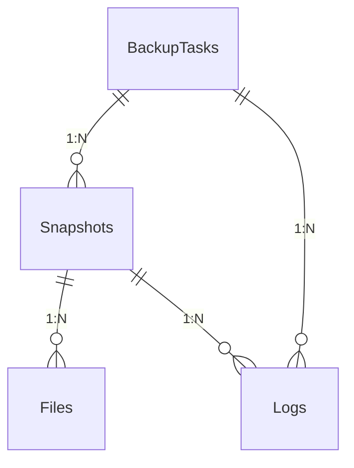

# 文件备份服务

文件备份服务为需要可靠数据保护的用户设计。结合全量备份、增量备份和虚拟备份技术，为用户提供灵活高效的数据保护方案。无论是个人用户的重要文档备份，还是企业级的数据归档需求，都能通过其直观的界面和强大的功能满足不同场景下的备份需求。系统采用SQLite数据库存储备份元数据，确保备份记录的安全性和可追溯性，同时支持SHA1校验保障文件完整性。

## 功能特性

1. 三种备份类型：
   1. 全量备份：对每个文件都进行备份
   2. 虚拟全量备份：类似全量备份，但仅将元数据写入数据库，不进行真正的文件复制
   3. 增量备份：仅备份新增、修改后的文件，未发生变动的文件不进行备份
2. 筛选：支持筛选文件，避免备份不重要数据，降低磁盘占用
3. 定时自动备份：支持定时后台自动扫描磁盘，按需进行备份
4. 快照系统：每次有效备份将形成一份快照，包含该时刻的文件结构，可以可以进行查看和回溯
5. 文件版本回溯：可以针对单个文件，查看其所有历史，方便回溯

## 备份任务配置

### 任务面板

左侧任务面板显示所有备份任务。

点击左下角新增按钮可新增一条备份任务。

选择一条备份任务，点击左下角删除按钮可删除该条备份任务。

### 配置面板

1. 基本信息
   1. 任务名：备份任务的名称
   2. 需要备份的目录：需要进行备份的目录
   3. 备份文件存放目录：备份后的文件快照，存放的位置。该位置应当与备份目录不在同一物理磁盘上
   4. 筛选：筛选需要备份的文件或目录
2. 定时备份
   1. 定时查看文件和目录的变化并备份：定时备份开关，开启后，将定时扫描备份目录，若有更新，则进行备份
   2. 备份时间间隔：两次扫描之间最小时间间隔
   3. 增量备份最大数量：优先进行增量备份，若达到一定数量，则进行一次全量备份
   4. 自动进行全量备份时，默认进行虚拟全量备份：是否使用虚拟全量备份而非普通全量备份

## 管理中心

进入管理中心后，首先选择一条备份任务，进行备份任务的管理界面。

### 快照面板

快照是指某一时刻，备份目录的文件目录结构。

首先应选择一个全量快照，所有的增量快照均依附于之前的、时间最近的全量快照。选择全量快照后，再在下方列表中显示全量快照或增量快照。

### 任务控制面板

- 立即备份：可以立即开始一次备份，或取消正在进行的备份。
- 清理：点击“整理文件”，将扫描在数据库中但不存在物理备份文件的项，以及存在物理备份文件但已无对应数据记录的项，后者将进行删除。

### 日志面板

若选择了快照，则显示选中快照的日志；否则，显示全部日志。日志默认仅显示当天，可以根据类型、时间范围、关键词进行筛选。

### 变更内容面板

列表展示了快照中新增、修改、删除的文件。

### 快照文件

列表展示了快照时刻的目录文件结构。

对于任意目录或文件，可以点击右侧的另存为按钮，实现文件或目录的回溯。若采用虚拟备份形式，从未发生过改变的文件将无法回溯。

### 文件历史记录面板

在“快照面板”中选择一个文件，则此处会显示该文件在不同时刻快照中的历史记录。可以点击右侧的另存为按钮，实现文件或目录的回溯。

## 原理解析

###  系统架构

- 表示层：基于Avalonia UI框架构建跨平台GUI，使用MVVM模式实现前后端分离
- 业务逻辑层：核心备份引擎采用C#实现，包含任务调度、文件处理和快照管理模块
- 数据访问层：使用Entity Framework Core操作SQLite数据库，存储备份元数据和操作日志

### 备份机制

该系统的备份机制采用智能分层策略，通过多阶段处理实现高效可靠的数据保护。

系统首先会扫描源目录建立完整的文件清单，然后根据配置策略自动选择备份模式：初始备份强制采用完整模式记录所有文件，后续备份则通过比对文件元数据（修改时间、大小）和内容哈希值智能识别变更文件，自动切换为增量模式仅备份差异内容。

系统采用版本链式管理，每个备份点生成包含完整文件树结构的快照，增量备份会记录相对于前个版本的文件变化（新增/修改/删除），并通过事务机制确保备份操作的原子性。

为优化存储效率，系统实现了文件内容去重技术，相同内容的文件只会物理存储一次，同时支持虚拟备份模式仅保存文件元数据。备份过程包含完整性校验环节，对所有文件计算校验和并记录，最后生成包含备份统计信息和水印的完整性报告。

### 定时检查机制

该系统的定时备份机制采用智能调度策略，通过多维度条件判断实现自动化备份管理。

每次触发备份前，系统会动态评估三个关键条件：首先检查任务配置中设置的时间间隔阈值，确保距离上次备份已超过最小时间间隔（默认为1分钟的保护性限制）；其次验证是否存在有效的基准快照（针对增量备份）；最后通过文件系统监控判断是否存在实质性文件变更。满足条件后，系统会根据预设策略自动选择备份模式：若检测到超过最大增量备份次数限制（可配置）或基准快照缺失，则自动升级为完整备份；否则采用增量备份仅处理变更文件。

整个调度过程采用双重保障机制，通过内存标记位防止并发执行，同时持久化记录任务状态确保意外中断后可恢复。系统还提供灵活的异常处理策略，对备份失败的情况会自动重试并渐进延长重试间隔，连续失败超过阈值后将转为告警状态等待人工干预。所有定时操作均记录带时间戳的审计日志，支持通过管理界面实时查看备份历史和执行状态。

### 数据库设计

**BackupTasks**：存储备份任务配置信息，包含任务名称、源路径、目标路径等字段

**Snapshots**：记录每次备份操作的元数据，通过TaskId关联到具体任务

**Files**：存储文件级别的备份记录，包含文件路径、大小、哈希等元数据

**Logs**：记录系统操作日志，按任务和快照分类存储

### 恢复机制

文件恢复功能基于备份时生成的快照记录和文件版本链实现，系统通过解析特定快照中的所有文件记录（包括新增、修改和删除操作），重建出该时间点的完整文件目录树结构。恢复时首先查询目标快照ID对应的元数据，然后根据文件记录类型（创建/修改/删除）逐步构建文件系统树，对于每个文件，系统会查找其对应的实际存储内容（通过备份文件名定位），并支持选择性恢复，可以恢复整个快照或单独恢复特定文件/目录，同时保留原始文件路径结构和属性信息（如修改时间等）。

在恢复过程中，系统会校验每个文件的完整性（通过存储的哈希值），并记录恢复操作的详细日志，确保数据准确性和可追溯性。